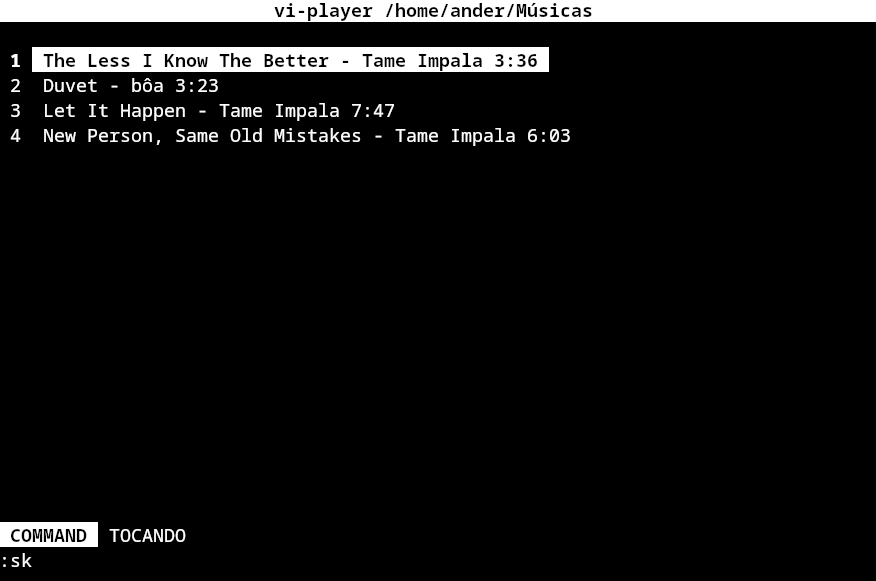

# vi-player



A proposta do projeto é de trazer a filosofia de ferramentas como [Vim](https://github.com/vimvim)/[NeoVim](https://github.com/neovim/neovim) para o controle e navegação musical. Em vez de depender de interfaces gráficas, mouse ou menus tradicionais, o vi-player transforma a reprodução de música em uma nova experiência baseada em:
- comandos
- modos
- atalhos de teclado
- renderização direta no terminal

## Sobre o Projeto

A ideia central não é apenas tocar música no terminal, mas trazer a experiência de navegação do vim para um contexto diferente e experimental. Inspirado em ferramentas como:
- ranger
- cmus
- ncmpcpp
- tmux

## Objetivos

O foco e diferencial do projeto está em:
- navegação rápída
- fluxo orientado ao teclado, por meio de modos, sem a necessidade de um mouse
- sistema de comandos extensível
- renderização manual de interface
- futura customização da experiência do usuário por meio de scripts

## Dependências
O projeto foi 100% desenvolvido em python, por meio de comandos nativos e ANSI Escape Codes, com abordagem semelhante a bibliotecas como curses e ncurses(C).

```
python-mpv
mutagen
```

Futuramente, irei adicionar um sistema de setup para instalar as dependências e arquivos de configurações iniciais, como temas e preferências.

### Como Usar

Execute o arquivo main.py. Ao executar, informe na frente, o diretório das músicas salvas no seu computador:
```
python main.py ~/Músicas/
```

Ao iniciar, use as teclas `j` e `k` para navegar entre as faixas.
Assim como no vim, digite `:` para entrar no modo de comando. Nele você pode usar a lista de comandos disponível nesse guia para navegar entre as faixas.
Use o comando `:q` quando quiser sair do player.

## Estado Atual do Projeto

Atualmente, o vi-player já possui:
- reprodução de músicas locais
- navegação entre faixas
- sistema básico de comandos e modos
- destaque visual básico das faixas selecionadas

Grande parte da arquitetura ainda está sendo construída e refatorada.

## Funcionalidades

- [x] Reprodução de músicas locais
- [x] Próxima música
- [x] Skip
- [x] Pause/Resume
- [x] Tema Customizável (Em desenvolvimento)
- [ ] Sistema de fila 
- [ ] Keybinds 
- [ ] Busca

