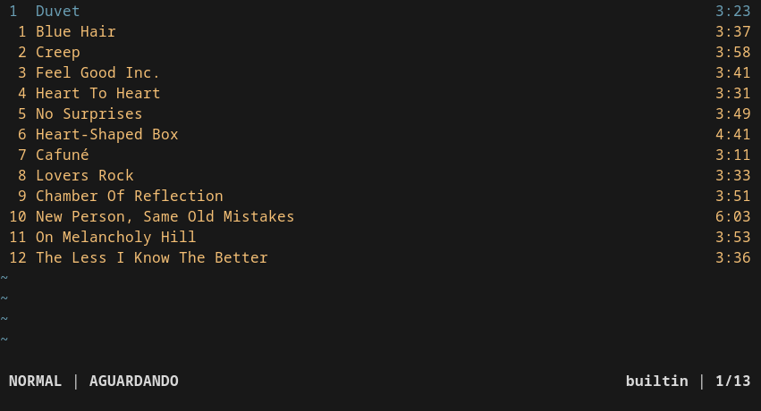

<h1 align="center">Vi-Player</h1>

<p align="center">
Um player de música para terminal focado em velocidade, simplicidade e controle por teclado. Inspirado pela filosofia do Vim e construído para fluxos de trabalho orientados ao terminal.
</p>

<p align="center">
  
  
</p>

<div align="center">
  
</div>

## Sobre

O Vi-Player é um reprodutor de música para terminal desenvolvido em Python que aplica conceitos de navegação modal inspirado por ferramentas como o Vim, Ranger, Cmus e Ncmpcpp.

## Objetivos

- Navegação rápida
- Interface modal
- Personalização
- Código aberto
- Compatibilidade multiplataforma

## Funcionalidades

- Reprodução de músicas locais
- Navegação modal
- Movimentação inspirada no Vim
- Sistema de comandos
- Sistema de temas

## Dependências

### Obrigatórias

- Python 3.11+
- MPV

### Bibliotecas Python

```bash
pip install python-mpv mutagen wcwidth
```

## Instalação

### Clonando o repositório

```bash
git clone https://github.com/not2nder/vi-player.git
cd vi-player
```

## Primeiros Passos

Inicie o player informando um diretório contendo arquivos de áudio:

```bash
python main.py ~/Musicas
```

Atualmente o Vi-Player suporta arquivos locais no formato `mp3`.

### Modos

O player utiliza dois modos principais:

| Modo        | Descrição                              |
| ----------- | -------------------------------------- |
| **NORMAL**  | Navegação pela interface               |
| **COMANDO** | Execução de comandos iniciados por `:` |

### Navegação Básica

| Tecla | Ação                  |
| ----- | --------------------- |
| `j`   | Próximo item          |
| `k`   | Item anterior         |
| `gg`  | Início da lista       |
| `G`   | Final da lista        |
| `:`   | Abrir modo de comando |

Informações mais detalhadas sobre navegação estão disponíveis em [docs/motions](/docs/motions.md).

### Reprodução

| Comando | Ação                          |
| ------- | ----------------------------- |
| `:p`    | Reproduzir música selecionada |
| `:pp`   | Pausar / Continuar            |
| `:n`    | Próxima música                |
| `:pv`   | Música anterior               |
| `:q`    | Sair do player                |

## Contribuindo

O projeto ainda está em desenvolvimento e mudanças estruturais são frequentes. Sugestões, correções e novas ideias são sempre bem-vindas.

## Licença

Distribuído sob a licença GPL-3.0.
