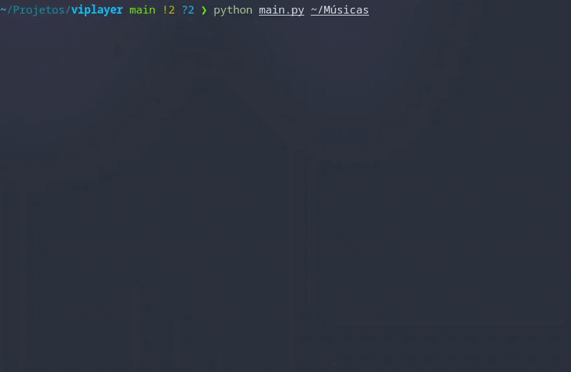

# vi-player



O **vi-player** é um player de música inspirado diretamente na filosofia do [Vim](https://github.com/vim/vim) e [NeoVim](https://github.com/neovim/neovim).
A proposta do projeto não é apenas reproduzir músicas no terminal, mas transformar a experiência de navegação musical em algo novo, orientado a:

- comandos
- modos
- atalhos de teclado
- renderização direta no terminal

## Filosofia

O projeto parte da ideia de que interfaces gráficas tradicionais nem sempre são a única forma de interagir com mídia. Em vez de botões, menus, mouse, múltiplas janelas, o vi-player aposta em comandos, navegação modal, atalhos inspirados no Vim, interface renderizada diretamente via ANSI Escape Codes.

A intnção é criar uma experiência que lembre ferramentas como:

- [Ranger](https://github.com/ranger/ranger)
- [Cmus](https://github.com/cmus/cmus)
- [Ncmcpp](https://github.com/ncmpcpp/ncmpcpp)
- [tmux](https://github.com/tmux/tmux)

## Objetivos

O foco principal é:

- navegação rápída
- fluxo orientado ao teclado
- sistema de comandos extensível
- renderização manual de interface
- arquitetura leve e extensível
- customização
- futura integração com scripts/plugins

## Estado Atual

Atualmente o projeto já possui funções básicas como:

- reprodução de músicas locais
- navegação entre faixas
- modos básicos
- destaque visual de seleção
- suporte inicial a temas

Grande parte da arquitetura ainda está sendo construída e refatorada conforme o projeto evolui.

## Funcionalidades

- [x] Reprodução de músicas locais
- [x] Navegação entre faixas
- [x] Pause/Resume
- [x] Tema Customizável (Em desenvolvimento)
- [ ] Sistema de fila 
- [ ] Keybinds customizáveis
- [ ] Busca
- [ ] Configuração via [Lua](https://www.lua.org)

## Dependências

O projeto foi desenvolvido em **PYthon**, utilizando renderização manual, sem frameworks TUI completos.

Bibliotecas atualmente utilizadas:

```
python-mpv
mutagen
```

NO futuro, o projeto terá:
- Sistema de setup automático
- instalação de dependências
- geração inicial de configurações

# Navegação

O vi-player utiliza navegação inspirada diretamente no Vim.

## Movimento

| Tecla | Ação |
|---|---|
| `j` | Próxima música |
| `k` | Música anterior |
| `h` | Início da lista |
| `l` | Final da lista |

## Modos

Como já foi explicado, o player funciona através de modos.

### NORMAL
Modo principal de navegação.

### COMMAND
Acesse pressionando `:`.

Exemplo:
```vim
:sk 10
```
Executa o comando de pular para a música de número 10

## Comandos atuais

| Comando | Função |
|---|---|
| `:p` | Reproduzir música |
| `:pp` | Pause/Resume |
| `:sk` | Pular para música |
| `:nx` | Próxima música |
| `:pv` | Música Anterior |
| `:o` | Abrir novo diretório |
| `:q` | Sair |

# Aviso

O projeto ainda está em desenvolvimento inicial e diversas partes da arquitetura estão sendo reestruturadas constantemente. Portanto, há muitos bugs e erros a serem tratados e corrigidos.
