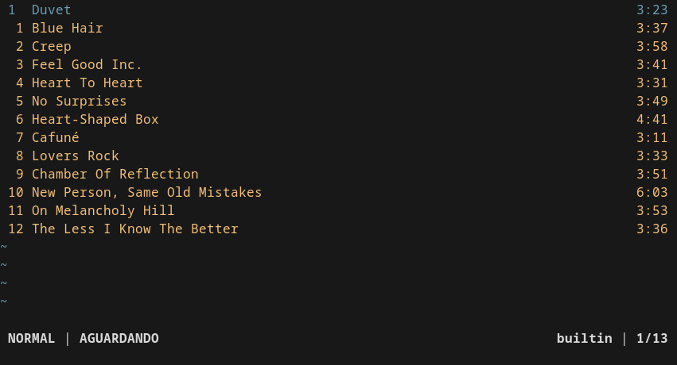
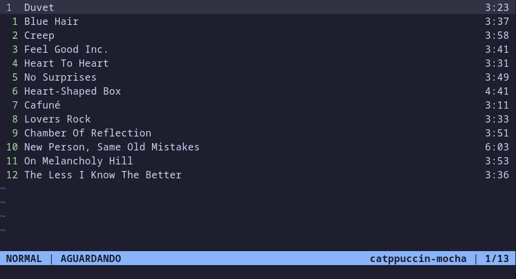
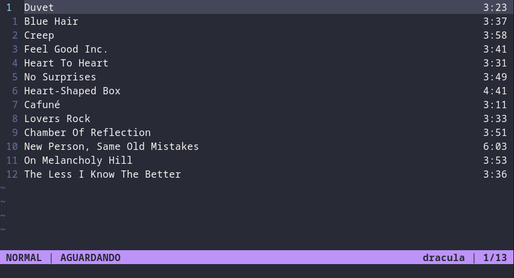
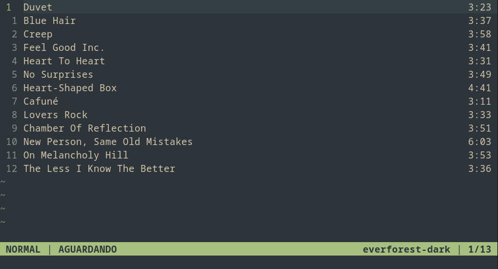
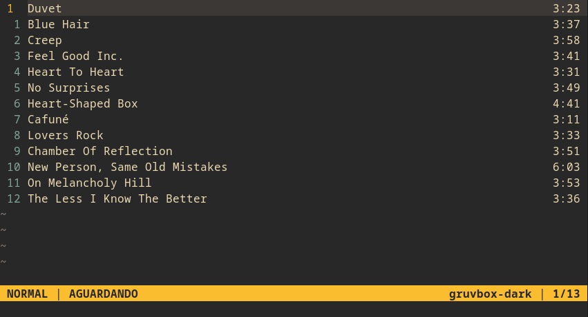
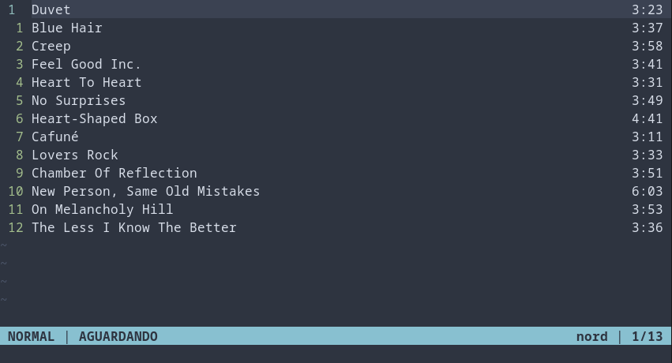
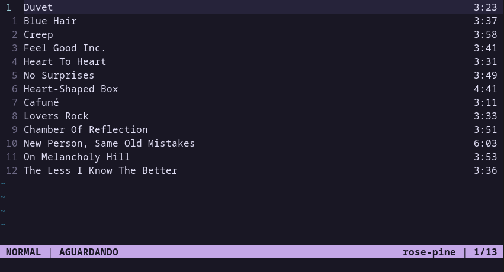
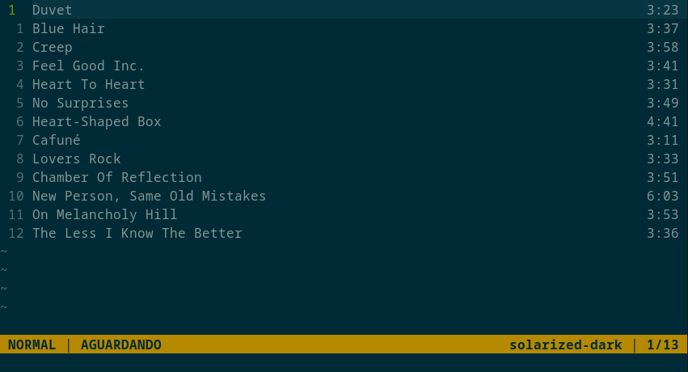
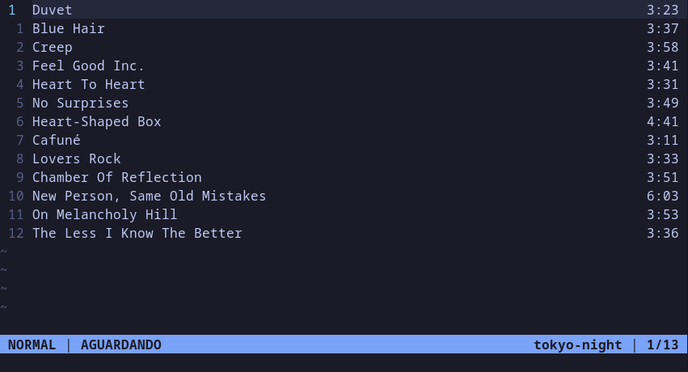
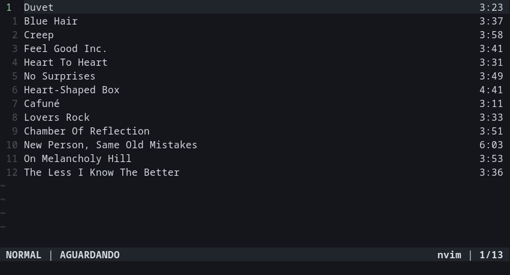

# Esquemas de cores

O vi-player possui suporte a esquemas de cores personalizados por meio de arquivos `.toml`, permitindo personalização completa da interface do player.

<div align="center">
    
</div>

## Organização dos temas

Os temas são carregados a partir de:

```text
~/.config/vi-player/themes/
```

Neste repositório, já existem alguns temas disponíveis para serem usados e modificados. basta copiar o conteúdo de `.config/vi-player/themes/` deste repositório para `~/.config/vi-player/themes`.

```text
~/.config/vi-player/themes/
├── catppuccin-mocha.toml
├── dracula.toml
├── everforest-dark.toml
└── ...
```

Para mudar um tema durante a execução do player, basta executar o comando:

```text
:colorscheme TEMA
```

sendo `TEMA` o nome do seu esquema de cores, sem a extensão `.toml`.

## Estrutura de um tema

Cada tema segue o formato `.toml`:

```toml
[meta]
name = "nord"

[palette]
background = "#2E3440"
foreground = "#D8DEE9"
accent = "#88C0D0"
muted = "#4C566A"

[highlight.Normal]
fg = "foreground"
bg = "background"

[highlight.CursorLine]
fg = "foreground"
bg = "surface"

[highlight.LineNr]
fg = "green"
bg = "background"

[highlight.CursorLineNr]
fg = "cyan"
bg = "background"

[highlight.StatusLine]
fg = "background"
bg = "accent"

[highlight.Muted]
fg = "muted"
bg = "background"

[highlight.Warning]
fg = "warning"
bg = "background"

[fillchars]
eob = "~"
```

### Meta

O campo **meta** do arquivo define os metadados do tema, como nome e autor:

```toml
[meta]
name = "meuTema"
author = "not2nder"
```

### Palette

Esse campo define as cores que o seu tema vai usar. Cada linha representa uma espécie de variável de cor, que pode ser acessada por determinados grupos.

```toml
[palette]
background = "#2E3440" # cor de fundo padrão
foreground = "#D8DEE9" # cor padrão do texto
accent = "#88C0D0" # textos destacados
muted = "#4C566A" # textos menos importantes
```

É possível definir mais do que essa quantidade de cores, dependendo de como deseja configurar cada tema.

### Highlights

O estilo dos componentes do player são divididos em grupos, chamados de **highlights**. Cada grupo aceita uma cor de fundo e uma cor de texto, que assume o valor da variável especificada em `[palette]`.

```toml
[highlight.Normal] # Cor padrão do player
fg = "foreground"
bg = "background"

[highlight.CursorLine] # Cor da linha do cursor
fg = "foreground"
bg = "surface"

[highlight.LineNr] # Índices da playlist
fg = "green"
bg = "background"

[highlight.CursorLineNr] # Índice da linha do cursor
fg = "cyan"
bg = "background"

[highlight.StatusLine] # Statusline
fg = "background"
bg = "accent"

[highlight.Muted] # Textos menos importantes, como fillchars
fg = "muted"
bg = "background"

[highlight.Warning] # Avisos da linha de comando
fg = "warning"
bg = "background"
```

Obrigatoriamente, cada grupo tem que ter um atributo **fg** e **bg** que representam a cor do texto e a cor de fundo, respectivamente.

### Fillchars

São os caracteres de preenchimento do player. Atualmente só existe um fillchar, o `eob`, que é o caractere que representa linhas vazias na playlist

```text
 1 Billie Jean
 2 Welcome to The Jungle
 3 Forever Young
~
~
```

Para mudar ou removê-los, basta mudar o campo **eob** da tabela.

```toml
[fillchars]
eob = "~"
```

## Exemplos de temas

Aqui estão os exemplos de esquemas de cores disponibilizados neste repositório:

<div align="center">
    
    <p>catppuccin-mocha</p>
</div>

<div align="center">
    
    <p>dracula</p>
</div>

<div align="center">
    
    <p>everforest-dark</p>
</div>

<div align="center">
    
    <p>gruvbox-dark</p>
</div>

<div align="center">
    
    <p>nord</p>
</div>

<div align="center">
    
    <p>rose-pine</p>
</div>

<div align="center">
    
    <p>solarized-dark</p>
</div>

<div align="center">
    
    <p>tokyo-night</p>
</div>

<div align="center">
    
    <p>nvim</p>
</div>

A coleção de temas disponível é inspirada em paletas amplamente utilizadas na comunidade de desenvolvedores.
