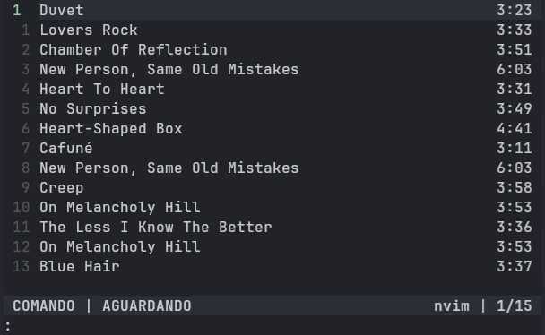

# Configuração

O Vi-Player utiliza arquivos externos para armazenar configurações do usuário, temas e preferências da aplicação.

# Diretório de Configuração

Os arquivos de configuração são armazenados em:

```text
~/.config/vi-player/
```

Antes de iniciar o player, mova o conteúdo da pasta `assets` para a pasta de configurações

```bash
mkdir -p ~/.config/v-player
cp -r assets/* ~/.config/vi-player
```

Estrutura esperada:

```text
~/.config/vi-player/
├── config.json
└── themes/
    ├── default.toml
    └── ...
```

# Arquivo Principal

O arquivo principal de configuração é o:

```text
config.json
```

Exemplo:

```json
{
  "general": {
    "theme": "default"
  },

  "player": {
    "relativenumbers": true
  }
}
```

# Configurações Gerais

Definidas no campo `general` do arquivo de configuração.

## Tema

Define o tema carregado durante a inicialização.

```json
{
  "general": {
    "theme": "default"
  }
}
```

O tema informado deve ser um dos presentes na pasta `~/.config/vi-player/themes`, sem a extensão .toml.

Ao iniciar o player, será aplicado o esquema de cores definido no arquivo de configuração.

<div align="center">
    
    <p>Tema padrão</p>
</div>

<div align="center">
    
    <p>everforest-dark</p>
</div>

<div align="center">
    
    <p>catppuccin-mocha</p>
</div>

<div align="center">
    
    <p>tokyo-night</p>
</div>

Alguns esquemas de cores podem variar, dependendo das configurações de cor padrão do seu terminal. Para mais informações sobre o tema, leia [docs/colorschemes](/docs/colorschemes.md).

# Configurações do Player

## Relative Numbers

Ativa ou desativa números relativos na playlist (Estilo Vim).

```json
{
  "player": {
    "relativenumbers": true
  }
}
```

Quando ativado, a linha atual representa o índice absoluto da lista, enquanto os outros índices representam a distância relativa até o índice atual.

<div align="center">
    
</div>

Isso facilita o uso de motions. Por exemplo:

```text
3j
```

Avança 3 índices baseado no índice atual.

```text
3k
```

Volta 3 índices com base no índice atual.

## Statusline

A statusline atualmente funciona como um componente individual do player, sendo possível customizar seu conteúdo. Alterando o campo `statusline` no arquivo de configuração, é possível definir o conteúdo desse componente.

```json
{
  "statusline": {
    "left": ["mode", "state"],
    "right": ["theme", "position"],

    "separator": "|"
  }
}
```

Os campo **left** e **right** recebe uma lista de módulos a serem carregados pelo player, da esquerda e direita, respectivamente.

| Módulo   | Descrição                                   |
| -------- | ------------------------------------------- |
| mode     | Modo atual do player (NORMAL/COMANDO)       |
| state    | Estado do player (tocando/pausa/aguardando) |
| position | Indicador da posição do cursor na lista     |
| theme    | Esquema de cores atual                      |
| percent  | % da playlist                               |
| song     | Nome da música atual tocando                |
| artist   | Nome do artista tocando                     |
| album    | Nome do álbum da música atual               |
|          |                                             |

O campo `separator` indica o caractere usado para separar os textos da linha de status.

```text
NORMAL | TOCANDO | Tame Impala                 default | 2/10
```

Conforme o projeto vai evoluindo, mais opções de customização serão adicionadas, não só da statusline, mas de todos os outros componentes individuais do player.
